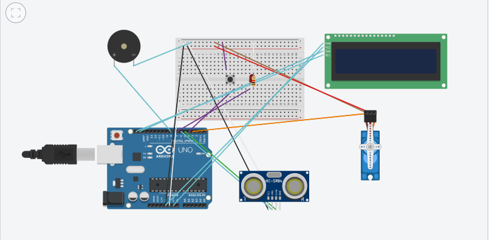

# 💊 Automatic Pill Dispenser

An IoT-based automatic pill dispenser for elderly care that ensures timely medicine intake through servo-controlled compartments, real-time clock scheduling, hand detection, manual confirmation, LCD display, and buzzer alerts.

## 📽️ Demo Video

🎥 Watch the full working demonstration on YouTube:  

---

## 📦 Features

- ⏰ **Real-Time Clock (RTC)** scheduling for up to 4 daily pill timings
- 🔁 **Servo mechanism** with rotating compartments and gate control
- 🔔 **Buzzer** and **LED** alerts for user notification
- 👋 **Ultrasonic sensor** for hand detection confirmation
- 🔘 **Manual button** as fallback confirmation
- 💡 **LCD screen** showing real-time clock and messages
- 📦 **Missed dose compartment** for safety and tracking
- 🧠 **Fail-safe logic** ensuring doses are logged and recovered

---

## 🖼️ Project Images

| Front View | Inside View | Dispensing in Action |
|------------|-------------|----------------------|
|  |  |  |

---

## 🛠️ Hardware Components

| Component           | Quantity |
|---------------------|----------|
| MG996R Servo (360°) | 1        |
| SG90 Servo (180°)   | 2        |
| DS3231 RTC Module   | 1        |
| HC-SR04 Ultrasonic  | 1        |
| TMB12A05 Buzzer     | 1        |
| LCD 16x2 (I2C)      | 1        |
| Push Button         | 1        |
| Arduino Uno         | 1        |
| Resistors, Wires, Tray, Frame | As required |

---

## 📐 Circuit Overview

> 🧩 All components are connected and controlled using Arduino.
>
> ✅ Servo and RTC handle scheduled doses  
> ✅ Buzzer and LED alert users  
> ✅ Sensor/Button detect confirmation  
> ✅ Missed doses redirected automatically

---

## 🔄 Working Mechanism

1. At the scheduled time (set via RTC), the servo rotates to the pill slot.
2. Gate servo opens, dropping the pill into the tray.
3. Buzzer and LED alert the user for 25 seconds.
4. If hand is detected or manual button is pressed, the alert stops.
5. If not confirmed, pill is redirected to the **missed dose compartment**.
6. LCD displays time, date, and status messages throughout the process.

---

## 📁 Code Overview

- Multiple Arduino programs developed, including:
  - RTC + Servo basic test
  - Multi-slot timer logic
  - Buzzer with different sound patterns
  - Ultrasonic and button-based confirmation
  - Final integrated code

> 📂 All code files are available in `/code` folder in this repository.

---

## 📈 Future Scope

- 📱 Mobile App for schedule setting and tracking
- 🌐 Wi-Fi/Bluetooth integration for alerts
- 🤖 Voice assistant (e.g., Alexa) support
- 📦 Refill alerts and logs of missed doses

---

## 👨‍💻 Authors

- **Nandini Soni** – [LinkedIn](https://www.linkedin.com/in/nandini-soni)  
- **Tanishka Jain** – [LinkedIn](https://www.linkedin.com/in/tanishkajain01/)  
- **Simran Goyal** – [LinkedIn](https://www.linkedin.com/in/simran-goyal-513111256/)  
---

## 📄 License

This project is licensed under the MIT License - see the [LICENSE](LICENSE) file for details.

